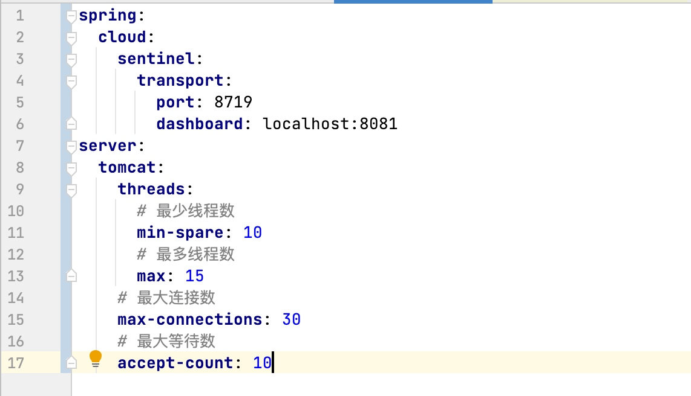
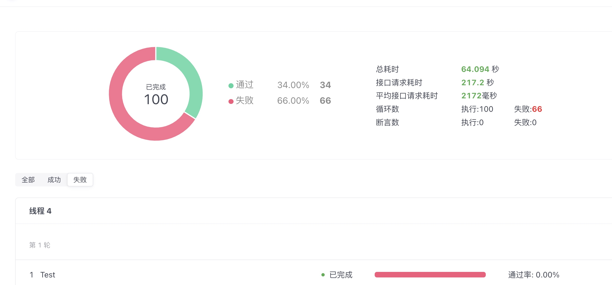
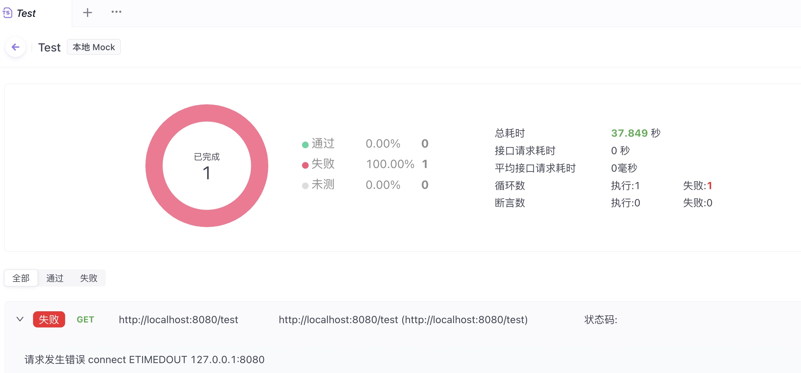

https://cloud.tencent.com/developer/article/2277236




```java
  @GetMapping("/test")
    public String test1(HttpServletRequest request) throws Exception {
        System.err.println("ip:"+request.getRemoteAddr() +"线程："+Thread.currentThread().getName());
        Thread.sleep(500);
        return "OK";
    }
```
注意我只sleep了500ms


开启压测：


**注意观察：平均请求远大于500ms**


看一下具体失败的请求：


**注意这个时候不会有500错误，就是什么都不会返回
这个时候再调用就是完全没有响应**